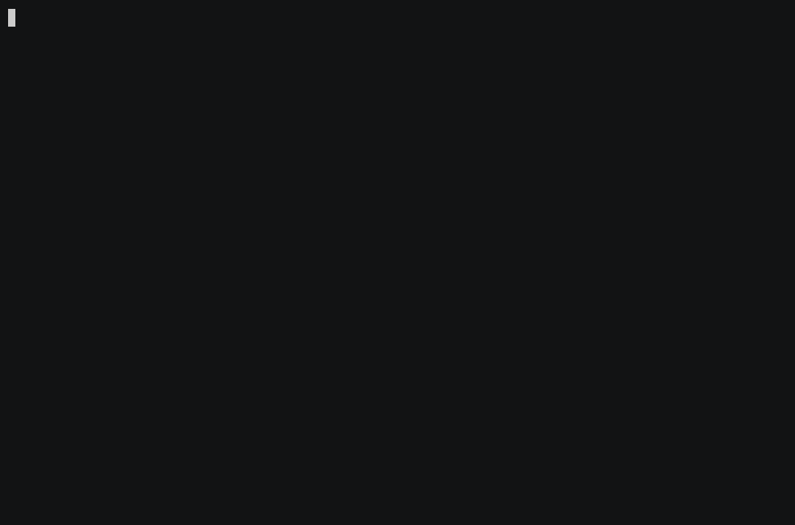

# SafeRoom

[](https://github.com/kascadeceo/saferoom/actions)
[](LICENSE)
[](https://www.python.org)
[](saferoom.py)

**The sign-off layer for AI coding agents.** Cloud sandboxes solve where agent
code runs. SafeRoom solves what ships.

The SafeRoom CLI is free, MIT-licensed, fully local, and usable without an
account. The planned SafeRoom Pro service adds shared governance for teams; it
does not replace or unlock the local safety workflow.

SafeRoom clones your repo into an isolated Docker container, swaps live
credentials for dummies, lets your agent run free, and hands you a full audit
trail — the submitted one-shot entrypoint or interactive shell history, captured
stdout/stderr, files changed, and a full reviewable diff. Nothing reaches your
real code until you approve it.

```
your repo ──clone──▶ sandbox container ──agent works──▶ audit report ──you approve──▶ your repo
                     (dummy .env, no prod access)       (transcript + diff)
```



## Why

Nearly half of AI-generated code fails security tests (Veracode, 2025). Claude
Code and Cursor can refactor your whole backend from one prompt — and one
hallucinated migration can drop your production tables. Sandboxes contain the
blast. SafeRoom contains the decision: what the agent produced only ships after
you've seen the diff.

## Install

**Linux (Debian/Ubuntu):**

```bash
git clone https://github.com/kascadeceo/saferoom && cd saferoom
sudo ./install.sh   # installs git/python3/docker.io only if missing; leaves an existing Docker alone
```

**macOS:** install [Docker Desktop](https://www.docker.com/products/docker-desktop/),
then `sudo ./install.sh`.

Single-file Python, stdlib only. If you can read `saferoom.py` in one sitting —
and you can — you know exactly what runs on your machine.

## Quick start

```bash
cd your-project
saferoom init                  # scans .env*, writes dummy-credential template + config
saferoom run                   # interactive sandbox shell — point your agent here
saferoom run -- claude -p "refactor the billing module"   # or one-shot
saferoom review                # entrypoint/history, transcript, files, full diff
saferoom approve               # git-apply the reviewed patch (.env* always excluded)
```

## Commands

| Command | What it does |
|---|---|
| `saferoom init` | Build dummy `.env` template and `saferoom.json` config |
| `saferoom run` | Clone repo → mount dummy creds → Docker sandbox → capture the run transcript |
| `saferoom run --offline` | Same, with no network in the container |
| `saferoom run --image node:22` | Choose the sandbox image |
| `saferoom run --screenshot URL` | Full-page UI capture after the run (playwright) |
| `saferoom review [session]` | Print the audit report |
| `saferoom approve [session]` | Apply the session patch to your working tree |
| `saferoom sessions` | List past sessions |
| `saferoom clean` | Delete oldest sessions, keep the newest 10 (`--keep N` to change); reports space freed |

## Guarantees

- Real credential values never enter the container — only generated dummies do.
- `approve` never writes `.env*` files back, even if the agent edited them.
- The sandbox is a throwaway clone; your working tree is untouched until approval.
- Everything is local. No telemetry, no account, no cloud.

## How SafeRoom relates to sandboxes you already use

E2B, Modal, and Daytona provide isolated compute for teams building agent
products. Claude Code's `/sandbox` and Cursor's sandbox mode contain the agent
while it runs. SafeRoom wraps around any of them: credential stripping, an
auditable record, and a required approval step before anything touches prod.
Use both.

## Free CLI vs. hosted Pro

SafeRoom draws the product boundary at the point where an individual workflow
becomes an organization-wide governance problem:

| Free, open-source SafeRoom CLI | Planned SafeRoom Pro / Kascade services |
|---|---|
| Run agents in a local, credential-stripped Docker sandbox | Centralize approved session history across teams |
| Review submitted entrypoints or interactive history, captured transcripts, changed files, and full diffs | Enforce review policy in CI and repository workflows |
| Manually approve a reviewed patch; `.env*` stays excluded | Manage organization roles, access, and key-stripping policy |
| Work fully offline with `--network none` | Export evidence for internal, SOC 2, HIPAA, and EU AI Act review processes |
| Keep audit artifacts on your machine, with no account or telemetry | Get managed rollout, governance design, and priority support from Kascade |

The complete local `init` → `run` → `review` → `approve` workflow remains
free and MIT-licensed. Pro is for coordination, enforcement, and reporting
across people and repositories—not for making the CLI safe or complete.

> **Availability:** SafeRoom CLI is available now. SafeRoom Pro is a planned
> hosted offering; its features and pricing may change before launch. Evidence
> exports can support an organization's compliance program, but do not by
> themselves make an organization compliant.

## Roadmap

- [ ] Database mutation capture (proxy Postgres/MySQL in the sandbox)
- [ ] API-call interception and logging
- [ ] HTML audit reports
- [ ] Hosted session history + CI hooks (paid tier)
- [ ] Compliance-mode logs (HIPAA / SOC 2 evidence format)

## SafeRoom Pro and Kascade

SafeRoom Pro is planned to start at $49/month for hosted session history, team
policy, CI enforcement, evidence exports, and priority support. Larger teams
can work with Kascade Security on managed deployment and governance. The CLI
stays MIT-licensed, local-first, and fully functional without either service.

Join the early-access list: https://getsaferoom.netlify.app

## Contributing

See [CONTRIBUTING.md](CONTRIBUTING.md). Issues and PRs welcome — especially
war stories about agents touching things they shouldn't have.

---
Built by [Kascade Security](https://www.kascadesecurity.com). MIT licensed.
